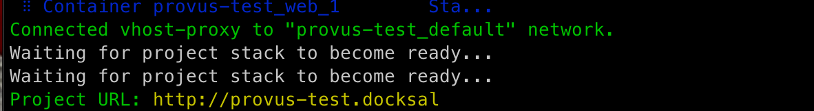
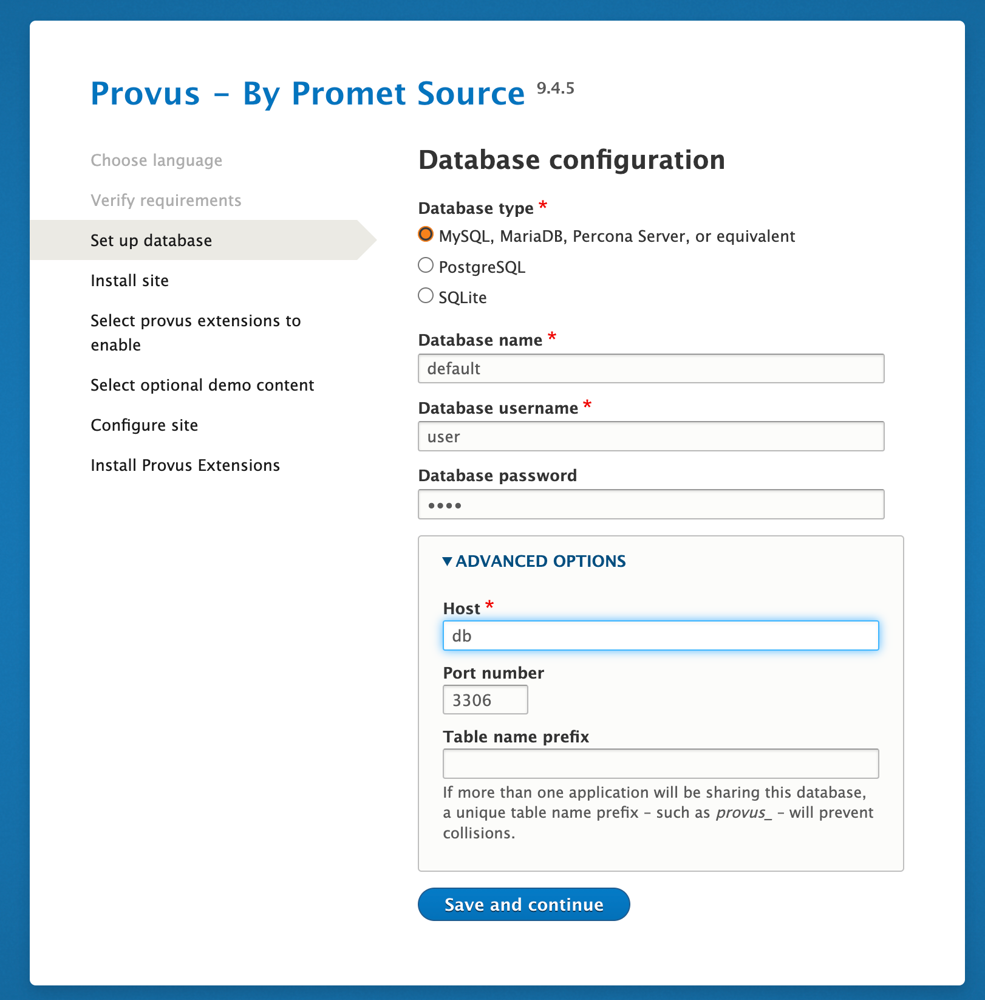
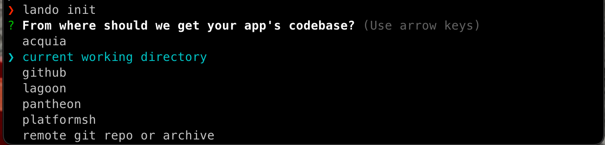
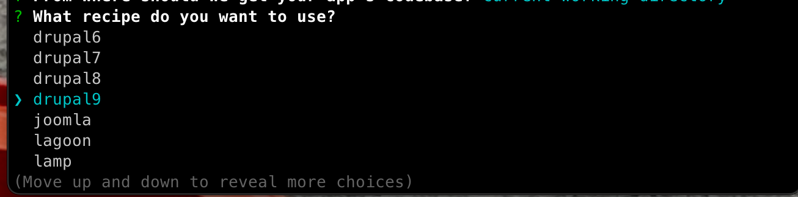
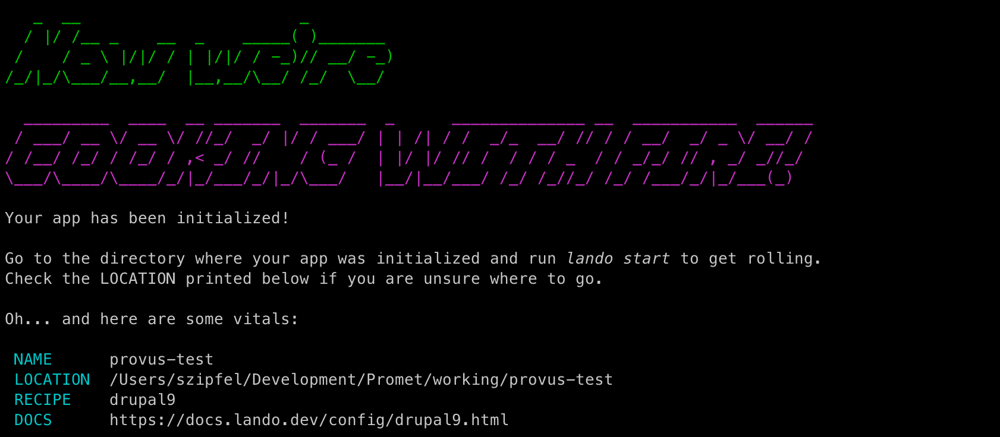
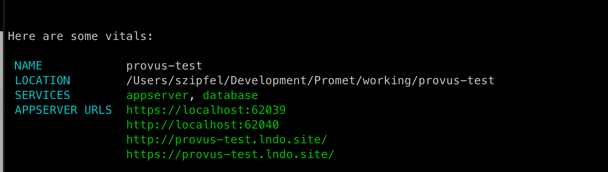
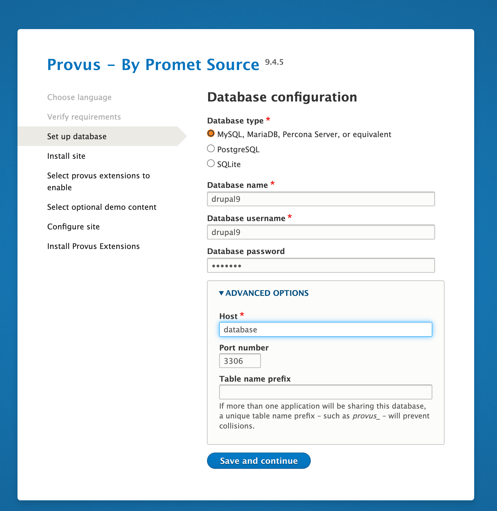

We recommend using the composer project to create a Provus based project.


```
composer create-project promet/provus-drupal <project-name>
```

# Local Dev Tools
## Docksal

Please read/review the Docksal installation instructions for your platform.

```
cd <project-name>
fin init
```
If docksal is successful you’ll see a listing for the project URL



in this case we’ll go to `http://provus-test.docksal`  and we’re immediately taken to the Drupal install screen where we provide database credentials.

For Docksal:
```
'database' => 'default',
'username' => 'user',
'password' => 'user',
'host' => 'db',
'port' => '3306',
```




## Lando
Please read/review the Lando installation instructions for your platform.


```
cd <project-name>
lando init
```
Accept current directory as `current working directory`



You will be asked some question by the `lando start` script:

Select `Drupal 9` recipe:



Type in `web` as the webroot


Choose a name for your app


If we have a success you should see something similar to the following:


```
Start your new dev environment in the <project-name> directory
```


To start the dev environment:
```
lando start
```


If successful you should see output that tells you how to access your new site:


When you go to your site, you should have a provus install screen that required the Lando db credentials

Lando defaults for the drupal 9 recipe:

```
database: drupal9
username: drupal9
password: drupal9
host: database
# for mysql
port: 3306
```




