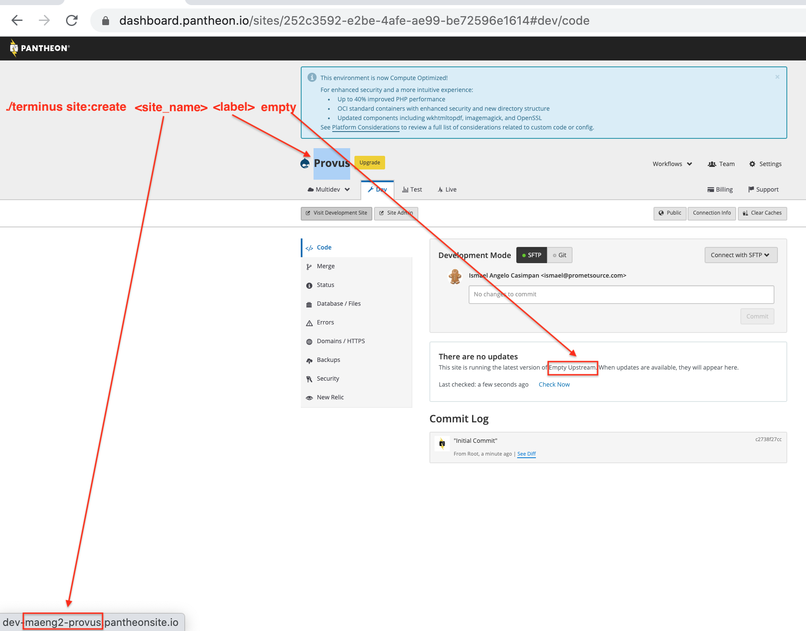

# Setting up on Pantheon

1. Create new site on Pantheon with empty upstream ``terminus site:create <site_name> <readable_label> <empty>``
   
2. Clone provus or site already in git locally ``git clone git@github.com:promet/provus.git newsite"
3. Add pantheon remote to docksal.env ``REMOTE_GIT_REPO=ssh://////////``
4. Build and push: ``fin deploy``
5. Copy aliases to project: ``terminus aliases; cp ~/.drush/sites/newsite.site.yml drush/sites/.``
6. Install site; ``fin drush @newsite.dev si minimal;fin drush @newsite.dev config-set system.site uuid 1aa3a078-6e7f-4336-b6d9-bec3b1e61561 -y; fin drush @newsite.dev cim -y``
7. Profit
