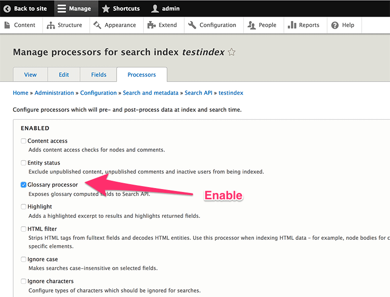
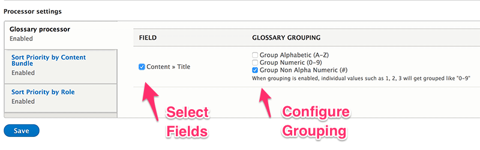
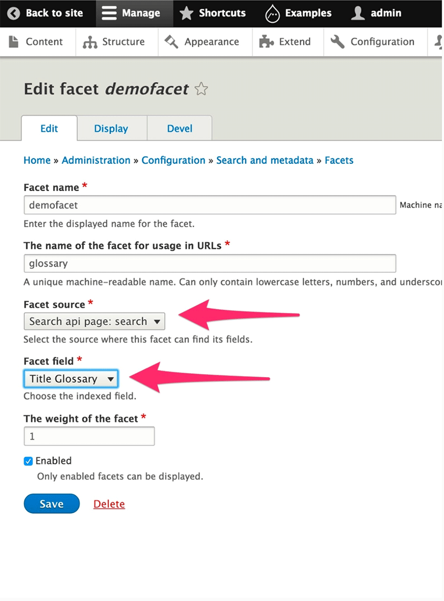
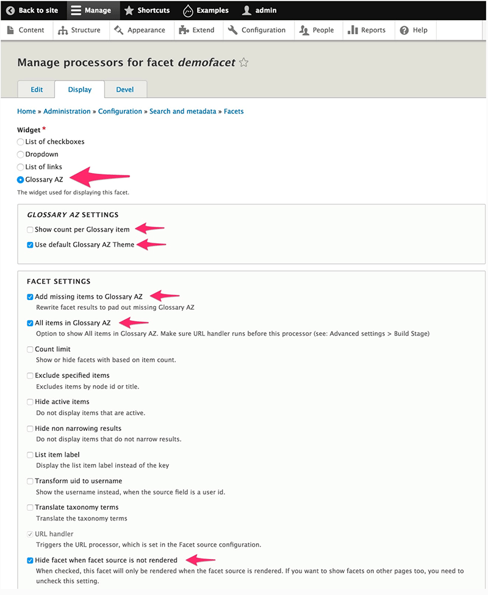
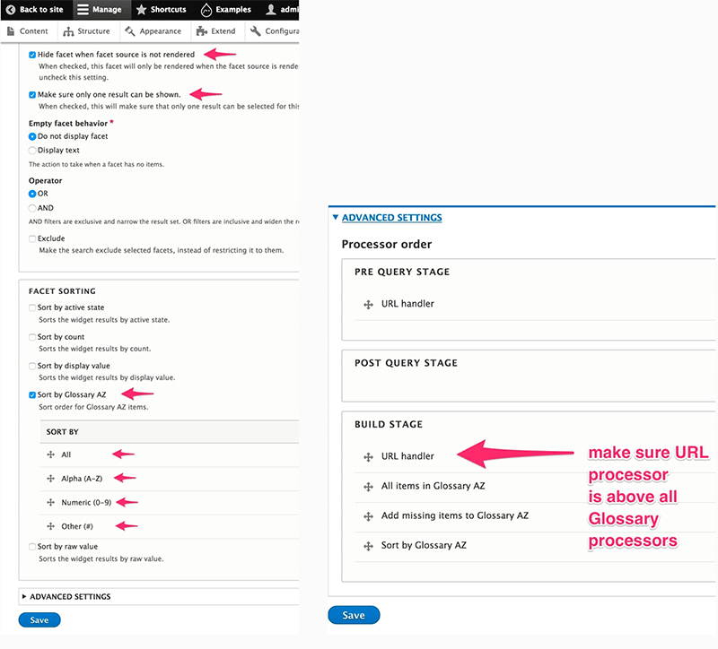
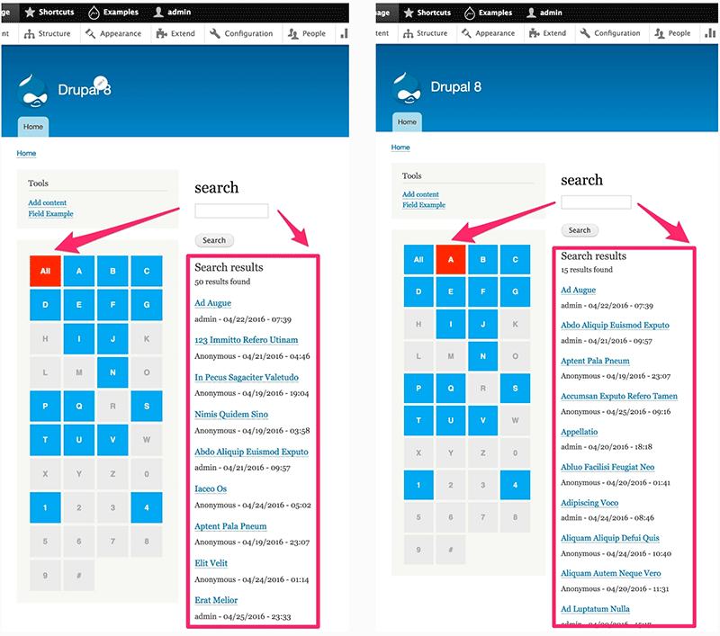

# Glossary AZ Search

## Search API Configuration

### 1: Enable Glossary Processor on Search API Index

### 2: Configure Glossary Processor

## Facet Configuration

### 1: Create a new facet
* Create new facet
* Select Source Backend
* Select Glossary Field

### 2: Configure the new facet
* Configure facet
* Save facet
* After saving, the facet is available as a block

## Enable & Configure the Block
* Enable and configure the block

